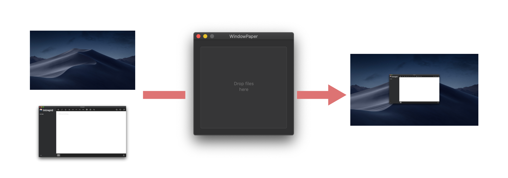

# WindowPaper

> WindowPaper = Window Screenshot + Wallpaper

## Intro

Make product screenshots easy. WindowPaper is a little app that takes a window screenshot and puts it on a wallpaper. It'll save you time having to do that in bulk for many screenshots.

Why is WindowPaper needed? The macOS screenshot tool lets you take windowed screenshots with nice shadows, however there is no way, at present, to show these window screenshots on a desktop wallpaper.

## Usage

### Basic

1. Take your windowed screenshot using Cmd-Shift-5.
2. Open WindowPaper and select your screenshot.
3. The screenshot is superimposed onto a wallpaper, and saved to the original location.

### Choose wallpaper
1. Select any image with "wallpaper" in its filename to choose it as the wallpaper. 
2. If no such image is supplied, the app defaults to its own wallpaper.

## Contributing

The `src/main.py` contains the Python script and virtual environment that powers the app. There is only one dependency (Pillow).

The app is built with Platypus, [according to these instructions](https://apple.stackexchange.com/questions/159611/including-python-script-dependencies-virtualenv-contents-in-platypus/171224).